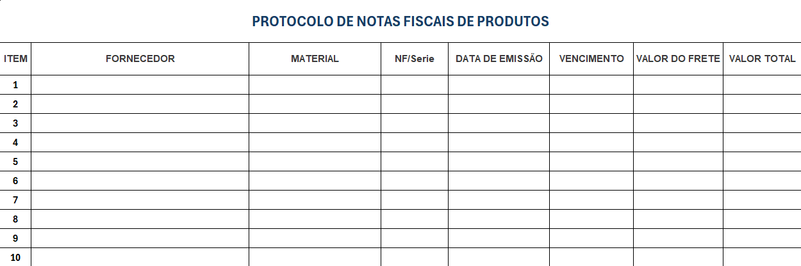
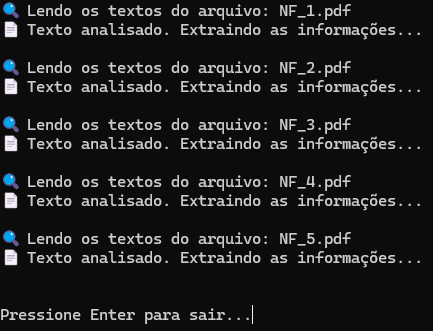
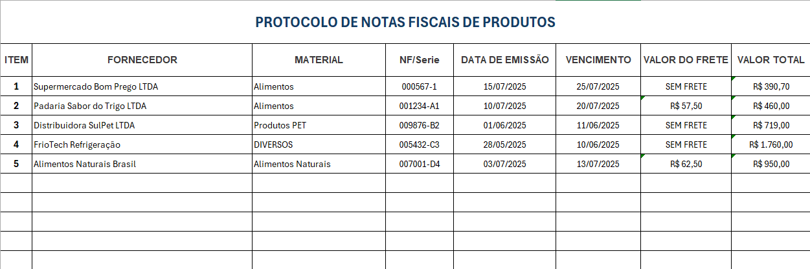

# 🧾 Automação de Notas Fiscais com OCR e IA

Sistema inteligente para leitura automatizada de notas fiscais em PDF, combinando OCR com pytesseract e interpretação semântica via IA (openai/gpt-4o).
O projeto tem como objetivo eliminar a digitação manual, permitindo a extração rápida, precisa e organizada de informações relevantes.

Os dados extraídos — como fornecedor, número da nota, valor do frete, valor total, descrição dos materiais, entre outros — são armazenados automaticamente em uma planilha Excel, centralizando as informações em protocolos prontos para consulta ou análise.

## 🚀 Tecnologias Utilizadas

* Python 3
* pytesseract 
* pandas
* openpyxl
* API(OpenRouter)

## 💻 Funcionalidades

* ✅ Conversão de PDFs em imagens para análise via OCR
* ✅ Extração de texto bruto com pytesseract
* ✅ Envio do conteúdo lido para uma IA (openai/gpt-4o) para interpretação dos dados
* ✅ Geração de um DataFrame com as informações estruturadas da nota
* ✅ Exportação dos dados para uma planilha .xlsx
* ✅ Adição automática em um protocolo Excel existente 
* ✅ Suporte a múltiplos arquivos PDF

## 📂 Estrutura dos Arquivos
- `leitor.py`: Script principal que coordena a leitura dos PDFs, extração dos textos, comunicação com a IA e exportação dos dados.
- `openai_api.py`: Módulo com a função gerar_resposta() que envia prompts para o modelo de linguagem (via API).
- `bin/`: Pasta que deve conter os executáveis do Poppler para conversão dos PDFs em imagens.
- `notas/`: Pasta onde ficam os arquivos PDF.
- `Tesseract-OCR/`: Pasta onde fica o executável tesseract.exe, necessário para a extração dos textos.
- `protocolo.xlsx`: Arquivo Excel no qual os dados extraídos são salvos/atualizados.

## 📸 Imagens









## 🧪 Como executar o projeto localmente

Siga os passos abaixo para rodar o projeto no seu ambiente:

1. **Crie uma nova pasta** e abra em uma IDE (recomendado: [Visual Studio Code](https://code.visualstudio.com/)).

2. **Crie um ambiente virtual (opcional, mas recomendado):**

```bash
python -m venv venv
```

Ative o ambiente virtual:

* No **Windows** (cmd ou PowerShell):

```bash
venv\Scripts\activate
```

> ⚠️ Se a execução estiver desabilitada no PowerShell, execute:
>
> ```powershell
> Set-ExecutionPolicy -ExecutionPolicy RemoteSigned -Scope CurrentUser
> ```

3. **Clone este repositório(requer o Git instalado) e navegue até a pasta correta:**

```bash
git clone https://github.com/nicolasandreos/Prontuario-de-Pacientes.git
cd Automacao-NF
```

4. **Instale as dependências do projeto:**

```bash
pip install -r requirements.txt
```

5. **Configure sua chave de API do OpenRouter:**

Para que a IA funcione corretamente, você precisa gerar uma chave de API gratuita:

Acesse: https://openrouter.ai

Clique em “Sign in with Google” para fazer login.

Após o login, vá até: https://openrouter.ai/keys

Clique em “Create new key” e copie a chave gerada.

No seu projeto, abra o arquivo openai_api.py e substitua a string `<SUA CHAVE AQUI>` pela sua chave copiada.

Exemplo:

```python
API_KEY = "sk-or-xxxxxxxxxxxxxxxxxxxxxxxxxxxxxxxxxxxxxxxxxxxxxxxx"
```

6. **Execute o projeto:**

```bash
python leitor.py
```
